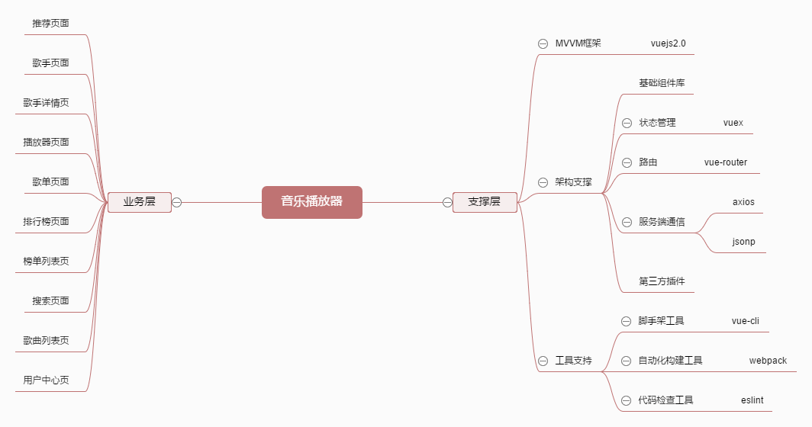
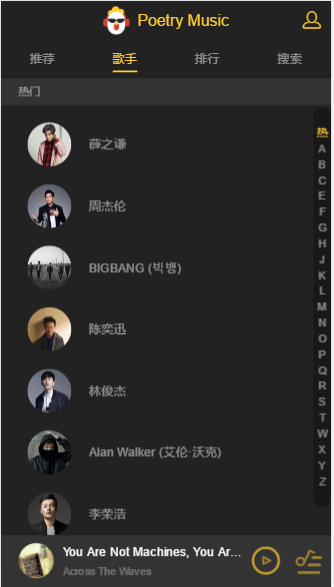
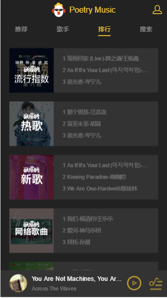
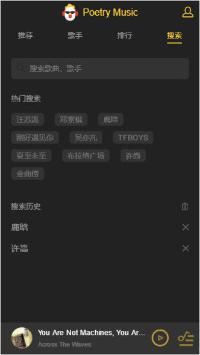
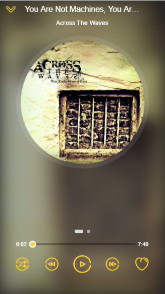
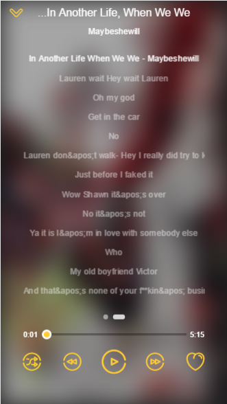

vue-music
---
> 使用vue2.0构建音乐播放器


项目组成
---




组件划分
---

**基础组件**

- confirm 确认对话框组件
- listview 通讯录列表组件
- loading 加载态组件
- no-result 无结果展示页面
- progress-bar 进度条组件
- progress-circle 圆形进度条组件
- scroll 移动端滚动组件
- search-box 搜索框组件
- search-list 搜索列表组件
- slider 轮播图组件
- switches 开关切换组件
- top-list 顶部消息提示组件
- song-list 歌曲列表组件

**业务组件**

- add-song 添加歌曲列表到组件
- disc 歌单详情页组件
- m-header 页面头部组件
- music-list 歌曲列表页面组件
- player 播放器内核组件
- playlist 播放列表组件
- rank 排行榜页面组件
- recommend 推荐页面组件
- search 搜索页面组件
- singer 歌手页面组件
- singer-detail 歌手详情页组件
- suggest 搜索提示列表组件
- tab 顶部导航栏组件
- top-list 排行榜详情页组件
- user-center 用户中心也组件


技术栈
---

- MVVM框架：vue.js(2.0)
- 状态管理：Vuex
- 脚手架：ve-cli
- 前端路由：Vue Router
- 服务端通信：axios、jsonp
- 懒加载：vue-lazyload
- 移动端滚动库：better-scroll
- 构建工具：webpack2.0
- 源码：es6
- 样式：stylus
- 规范：eslint


项目结构
---


使用方法
---

```
git clone https://github.com/poetries/vue-music.git

# 进入根目录
cd vue-music

# 安装依赖
npm install

# 开发
npm run dev

# 构建
npm run build
```

screenshot
---

- 推荐、歌手、排行页面






- 搜索、播放页面







License
---

© 2017 A poetries's [Ideas](https://github.com/poetries/ideas).

